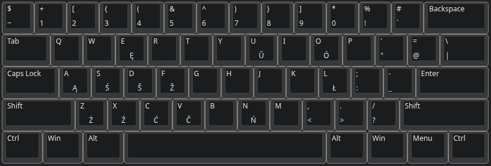

# セイネ

## Why QWERTY?

QWERTY is (unfortunately) the global standard.

Yeah, Dvorak offers ergonomic advantages, but most software and games defaults
to QWERTY. For me, sticking with QWERTY ensures maximum compatibility without
having to constantly remap keys.

## What’s the difference between qwerty-seine and the default one?

After messing around with Programmer’s Dvorak for about a week, I noticed
something funny: even though I was completely not proficient with it, it still
felt weirdly convenient and familiar.

Except, well, the "7531902468" moment. And the fact that, out of all brackets,
only `(` and `)` were on the same fingers.

Turns out I wasn’t the only one who thought this — I stumbled across
[ThePrimeagen’s Real Programmer’s Dvorak](https://github.com/ThePrimeagen/keyboards),
and it actually fixes all those problems.

So the idea here is: can QWERTY be improved by placing symbols the same way
they are on Real Programmer’s Dvorak? My layout tries exactly that.

## Polish?

Yes, and not only, since now I am studying here, having additional symbols on altgr is convinient. For more info refer to qwerty-seine file.

## Preview



## Installation

Check and run installation script

Then ```sudoedit /usr/share/X11/xkb/rules/evdev.xml``` and add it near the
other English keyboards

```
<variant>
    <configItem>
        <name>qwerty-seine</name>
        <description>English (Seine)</description>
    </configItem>
</variant>
```

reboot
